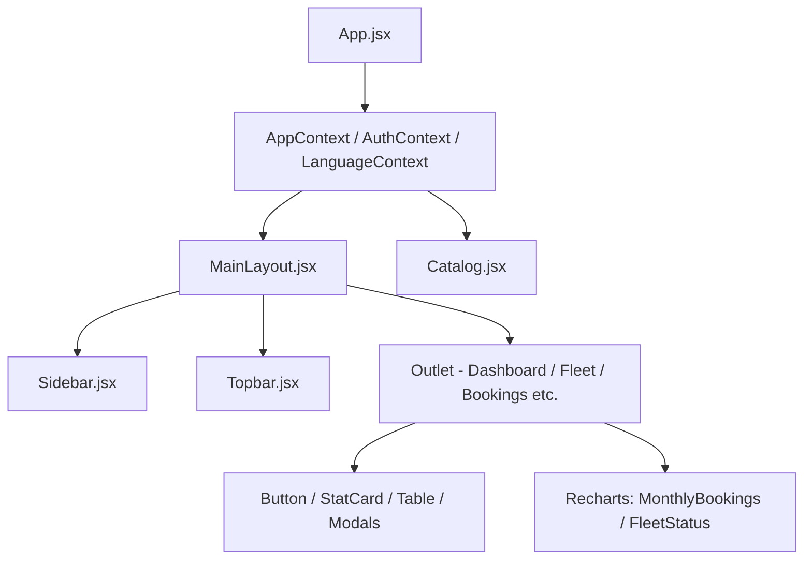

# Implementation Plan - Unified Light/Dark Theming Architecture

This document details the analysis of the current design system and the engineering plan to introduce a scalable, unified light/dark theme toggle system without visual regressions.

---

## Phase 1: Deep Design Audit & Component Analysis

We have analyzed the codebase's existing layout, stylesheet (`src/index.css`), Tailwind config (`tailwind.config.js`), and page/component styles. Here are the core findings:

### 1. Current Dark Theme UX/UI Governing Principles
* **Primary Canvas**: A deep navy/midnight color palette using `#0a0e27` as the default background, set globally on the `body` in `index.css`.
* **Elevated Surfaces**: Modals, dropdowns, and card components utilize either `.glass` (`bg-white/5`), `.glass-dark` (`bg-[#0f1435]/80`), `bg-zinc-950`, or `bg-black` with subtle borders (`border-zinc-800` or `border-white/10`).
* **Visual Polish**: Employs frosted glassmorphism textures (`backdrop-blur-md/xl`) and animations (Framer Motion scales and translations) to create a premium feel.
* **Text Hierarchy**: White (`text-white` or `text-theme-primary`) for primary headings, zinc values (e.g., `text-zinc-400` or `text-theme-secondary` / `text-zinc-500`) for secondary text.
* **Action Accents**: Primary action buttons utilize a strong royal blue (`#2563eb`, brand-blue) and success elements utilize emerald/green (`#10b981`), while destructive/warning actions use red (`#ef4444`, brand-red).

### 2. Identified Inconsistencies & Hardcoded Style Patterns
* **Scattered Hex Codes**: The base background `#0a0e27` is repeated across multiple entry points and layout files:
  * [src/index.css](file:///c:/Users/NAFIE/Desktop/Personal/projects/car-rental/src/index.css#L9)
  * [src/pages/Catalog.jsx](file:///c:/Users/NAFIE/Desktop/Personal/projects/car-rental/src/pages/Catalog.jsx#L54)
  * [src/pages/Login.jsx](file:///c:/Users/NAFIE/Desktop/Personal/projects/car-rental/src/pages/Login.jsx#L40)
  * [src/components/layout/Sidebar.jsx](file:///c:/Users/NAFIE/Desktop/Personal/projects/car-rental/src/components/layout/Sidebar.jsx#L45)
  * [src/components/auth/ProtectedRoute.jsx](file:///c:/Users/NAFIE/Desktop/Personal/projects/car-rental/src/components/auth/ProtectedRoute.jsx#L10)
* **Tailwind Class Inconsistencies**: Some dashboard files refer to `text-theme-primary` or `bg-theme-sidebar`, which are currently **undefined** in `tailwind.config.js` and fall back to raw browsers settings. In contrast, other pages hardcode raw utility colors like `bg-zinc-950` and `border-zinc-800` directly.
* **Hardcoded Chart Colors**: Recharts components (`MonthlyBookingsChart.jsx` and `FleetStatusChart.jsx`) hardcode fill, stroke, and grid lines using hex strings (e.g., `#27272a`, `#52525b`, `#71717a`). In light mode, these dark colors will conflict with lighter card surfaces.

### 3. Component Hierarchy & Style Inheritance

Currently, layouts and pages directly apply styling wrapper classes. Standardizing these layouts onto a unified CSS variable base is crucial.

---

## User Review Required

> [!IMPORTANT]
> **Theme Application Strategy**: We will use a **Semantic CSS Variables approach** mapped inside `tailwind.config.js`. This prevents duplication of Tailwind markup in files and centralizes light/dark variants.
> 
> **Recharts Color Mapping**: Chart elements will dynamically read active colors from a JavaScript theme mapping derived from active CSS values or local theme context (e.g., passing light/dark stroke configurations).

---

## Open Questions

> [!NOTE]
> No immediate blocker questions. We will use the system theme as a fallback when loading the app for the first time.

---

## Proposed Changes

We will execute the rest of the project across the following components:

### Styles System

#### [MODIFY] [index.css](file:///c:/Users/NAFIE/Desktop/Personal/projects/car-rental/src/index.css)
* Define CSS variable registers under `:root` (light values) and `.dark` (dark values).
* Update `.glass`, `.glass-dark`, and body declarations to consume these variables.

#### [MODIFY] [tailwind.config.js](file:///c:/Users/NAFIE/Desktop/Personal/projects/car-rental/tailwind.config.js)
* Configure Tailwind config to enable `class` dark mode: `darkMode: 'class'`.
* Extend the `colors` property with a semantic `theme` object resolving to the new CSS variables (e.g., `theme-primary`, `theme-sidebar`, `theme-card`).

### Common Elements

#### [MODIFY] [Button.jsx](file:///c:/Users/NAFIE/Desktop/Personal/projects/car-rental/src/components/common/Button.jsx)
* Update button styles to handle light/dark transitions smoothly. Secondary and ghost variants will consume variables instead of hardcoded zinc colors.

#### [MODIFY] [LanguageSelector.jsx](file:///c:/Users/NAFIE/Desktop/Personal/projects/car-rental/src/components/common/LanguageSelector.jsx)
* Standardize selectors to adapt seamlessly when theme changes.

### Core Layouts

#### [MODIFY] [Sidebar.jsx](file:///c:/Users/NAFIE/Desktop/Personal/projects/car-rental/src/components/layout/Sidebar.jsx)
* Make sidebar panel background, dividers, hover highlights, and text colors use theme-aware classes.

#### [MODIFY] [Topbar.jsx](file:///c:/Users/NAFIE/Desktop/Personal/projects/car-rental/src/components/layout/Topbar.jsx)
* Add the **Theme Toggle** control (sun/moon icons) next to Language/Notification selectors.
* Style the profile, notifications dropdown, and search interfaces using theme variables.

### Charts & Dashboard

#### [MODIFY] [MonthlyBookingsChart.jsx](file:///c:/Users/NAFIE/Desktop/Personal/projects/car-rental/src/components/dashboard/MonthlyBookingsChart.jsx) & [FleetStatusChart.jsx](file:///c:/Users/NAFIE/Desktop/Personal/projects/car-rental/src/components/dashboard/FleetStatusChart.jsx)
* Use dynamic fill and stroke colors based on active theme context.

### Pages

#### [MODIFY] [Catalog.jsx](file:///c:/Users/NAFIE/Desktop/Personal/projects/car-rental/src/pages/Catalog.jsx), [Login.jsx](file:///c:/Users/NAFIE/Desktop/Personal/projects/car-rental/src/pages/Login.jsx), etc.
* Replace raw background hexes `#0a0e27` with `bg-theme-bg`.

---

## Verification Plan

### Automated Tests
* Run `npm run build` to verify there are no compilation errors.
* Execute `npm run lint` to confirm clean formatting and code sanity.

### Manual Verification
* Deploy/run locally and toggle theme inside the Topbar.
* Verify that:
  1. No text becomes illegible (e.g., white text on white background).
  2. Modals, search bars, inputs, dropdowns, and borders adapt cleanly.
  3. Recharts change text/grid colors when theme toggles.
  4. Selected theme persists across page reloads.
